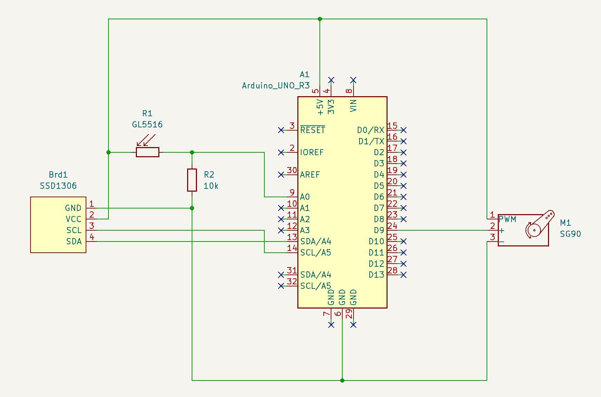

# LDR TFT Servo

https://github.com/piotrpdev/furnace_auto_reset/assets/99439005/6d7776c3-94ba-481f-ab1f-77f8868cc247

Arduino sketch that rotates a servo when a light dependent resistor is exposed to enough light, also displays some information on a small TFT display.

## Circuit

### Parts

- Arduino Uno
- SSD1306 TFT display
- SG90 Servo
- GL5516 LDR
- 10 kΩ resistor

### Diagrams

| Breadboard | Schematic |
| ---------- | --------- |
|      |        |

## License

MIT License, see [LICENSE](./LICENSE).

Based on example code from Adafruit, which is under the [BSD license](https://github.com/adafruit/Adafruit_SSD1306/blob/5fa3388757f5a3db2dcf01f888e4b2fa61eebf7e/license.txt).
